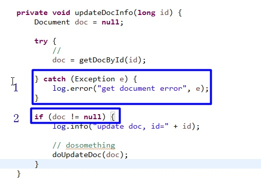
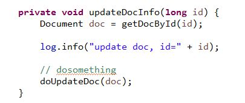

# 异常处理

对于大型IT系统，最怕的事情第一是系统出现了异常我不知道，等问题闹大了用户投诉了才知道出问题了。第二就是出了问题之后无法找到出错原因。针对这2个问题，说说我们项目组是怎么样规定异常处理的。

再次声明我的观点，我这系列贴里面，没有什么技术点，都是一些编程的经验之谈，而且是建立在项目背景是大部分代码都是简单的CRUD、开发人员流动大水平一般的情况下。希望读者的重点不要再关注技术点。大部分工作中不需要什么技术，你只要把代码写好，足够你轻松面对！

言归正传，说回第一个问题，系统出异常了我不知道，等问题闹大了用户投诉了才知道。这个问题出现非常多，而且非常严重。我不知道其他公司有没有这种场景，对我们公司而言，经常会出现用户反馈、投诉过来说某个功能不可用，开发人员定位分析之后，才发现之前的某一步出错了。公司业务流程非常复杂，和周边系统一堆集成，一堆的后台队列任务，任何一部都可能出问题。

举几个今年真实的案例：

1 某系统销户无法成功，最后定位发现前段时间ldap密码修改没有更新

2. 某个流程失败，最后发现集成的系统新增加了NAS盘，防火墙不通无法访问导致报错。

3、某个功能无法使用，查看日志发现后台定时任务已经停了好几天。

针对这些功能，在流程上当然可以采取相对的策略来保证，但从开发的角度来说，任何规定都无法保证一定不会发生错误，老虎也有打盹的时候，我只相信代码。

## 错误范例

贴一段非常常见的代码，大家觉得这段代码有没有问题？

在我看来，这段代码**很多时候**问题特别大！

* 丢掉了异常

异常就算打印了堆栈，也不会有人去看的！除非用户告诉你出问题了，你才会去找日志！所以，看着好像很严谨的代码，其实作用并不大。

* 空判断隐藏了错误

 异常处理再加上框框2处的空判断，天衣无缝的避开了所有正确答案。本来需要更新文档，结果什么错误没有报，什么也没有做。你后台就算打了日志堆栈又怎么样？

所以，我对开发人员的要求就是，**绝大部分场景，不允许捕获异常，不要乱加空判断**。只有明显不需要关心的异常，如关闭资源的时候的io异常，可以捕获然后什么都不干，其他时候，不允许捕获异常，都抛出去，到controller处理。空判断大部分时候不需要，你如果写了空判断，你就必须测试为空和不为空二种场景，要么就不要写空判断。

强调，有些空判断是要的，如：参数是用户输入的情况下。但是，大部分场景是不需要的（我们的IT系统里面，一半以上不需要），如参数是其它系统传过来，或者其他地方获取的传过来的，99.99%都不会为空，你判断来干嘛？就抛一个空指针到前台怎么啦？何况基本上不会出现。

**新手最容易犯的错误，到处捕获异常，到处加空判断，自以为写出了“健壮”的代码，实际上完全相反**。导致的问题，第一代码可读性很差，你如果工作了看到一半代码是try-catch和空判断你会同意我的观点的，第二更加重要的掩盖了很多错误，如上面图片的例子！日志是不会有人看的，我们的目的是尽早让错误抛出来，还有，你加了空判断，那你测试过为空的场景吗？

web请求上的异常，不允许开发人员捕获，直接抛到前台，会有controller处理！见之前的Controller规范

所以上面的代码，我来写的话是这样的，清晰明了。

另外一种后台定时任务队列的异常，其实思路是一样的，有个统一的地方处理异常，里面的代码同样不准捕获异常！然后异常的时候邮件通知到我和开发人员，开发组长必须知道后台的任何异常，不要等用户投诉了才知道系统出问题了。

另外，开发组长需要自己定义好系统里面的异常，其实能定义的没有几种，太细了很难落地，还有，异常不要继承Exception，而是继承RuntimeException，否则到时候从头改到尾就为了加个异常声明你就觉得很无聊。

## 异常处理要求

* 开发组长定义好异常，异常继承RuntimeException。

* 不允许开发人员捕获异常。

异常上对开发人员就这点要求！异常都抛出到controller上用AOP处理。后台（如队列等）异常一定要有通知机制，要第一时间知道异常。

* 少加空判断，加了空判断就要测试为空的场景！

这篇文章，我估计一定有很多争议，这些规则都和常见的认识相反，我在公司里面推广和写贴分享的时候也有人反对。但是，**你要知道你遇到的是什么问题，要解决的是什么问题**？我遇到是很多异常本来很简单，但由于一堆“健壮”的try-catch和空判断，**导致问题发现很晚**，可能很小一个问题最后变成了一个大事件，在一些IT系统里面，尤其常见。大家不要理解为不能加空判断，大家见仁见智吧。反正我是这样写代码的，我发现效果很好，我很少花时间在调试代码和改bug上，更加不会出现前台返回成功，后台有异常什么也没有做的场景。

最后对新手说一句，**不要养成到处try-catch和加空判断的恶习**，你这样会掩盖掉很多错误，给人埋很多坑的！