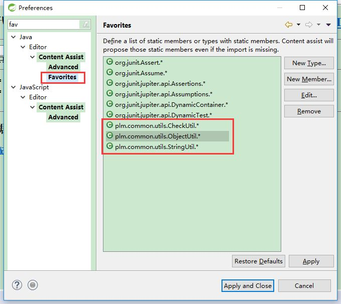
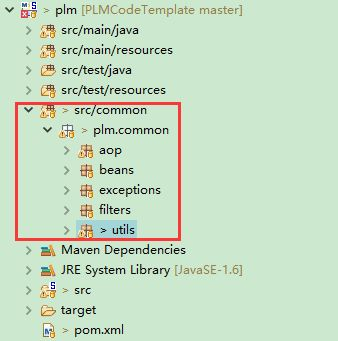

# 工具类编写

一个项目不可能没有工具类，工具类的初衷是良好的，代码重用，但到了后面工具类越来越乱，有些项目工具类有几十个，看的眼花缭乱，还有不少重复。如何编写出好的工具类，我有几点建议：


## 隐藏实现

就是要**定义自己的工具类，尽量不要在业务代码里面直接调用第三方的工具类**。这也是**解耦**的一种体现。

如果我们不定义自己的工具类而是直接使用第三方的工具类有2个不好的地方：

* 不同的人会使用不同的第三方工具库，会比较乱。
* 将来万一要修改工具类的实现逻辑会很痛苦。

以最简单的字符串判空为例，很多工具库都有 `StringUtils`工具类，如果我们使用 `commons` 的工具类，一开始我们直接使用 `StringUtils.isEmpty` ，字符串为空或者空串的时候会返回为true，后面业务改动，需要改成如果全部是空格的时候也会返回true，怎么办？我们可以改成使用 `StringUtils.isBlank` 。看上去很简单，对吧？ 如果你有几十个文件都调用了，那我们要改几十个文件，是不是有点恶心？再后面发现，不只是英文空格，如果是全角的空格，也要返回为true，怎么办？StringUtils上的方法已经不能满足我们的需求了，真不好改了。。。


所以我的建议是，一开始就自己定义一个自己项目的 `StringUtil`，里面如果不想自己写实现，可以直接调用 `commons` 的方法，如下：

```java
public static boolean isEmpty(String str) {
  return org.apache.commons.lang3.StringUtils.isEmpty(str);
}
```

后面全部空格也返回true的时候，我们只需要把isEmpty改成isBlank；再后面全部全角空格的时候也返回true的话，我们增加自己的逻辑即可。我们只需要改动和测试一个地方。


再举一个真实一点的例子，如复制对象的属性方法。


一开始，如果我们自己不定义工具类方法，那么我们可以使用 `org.springframework.beans.BeanUtils.copyProperties(source, dest)` 这个工具类来实现，就一行代码，和调用自己的工具类没有什么区别。看上去很OK，对吧？


随着业务发展，我们发现这个方式的性能或者某些特性不符合我们要求，我们需要修改改成 `commons-beanutils`包里面的方法，`org.apache.commons.beanutils.BeanUtils.copyProperties(dest,source)`，这个时候问题来了，**第一个问题**，它的方法的参数顺序和之前spring的工具类是相反的，改起来非常容易出错！**第二个问题**，这个方法有异常抛出，必须声明，这个改起来可要命了！结果你发现，一个看上去很小的改动，改了几十个文件，每个改动还得测试一次，风险不是那么得小。有一点小崩溃了，是不是？


等你改完之后测试完了，突然有一天需要改成，复制参数的时候，有些特殊字段需要保留（如对象id）或者需要过滤掉（如密码）不复制，怎么办？这个时候我估计你要崩溃了吧？不要觉得我是凭空想象，编程活久见，你总会遇到的一天！


所以，我们需要定义自己的工具类函数，一开始我定义成这样子。

```java
public void copyAttribute(Object source, Object dest) {
  org.springframework.beans.BeanUtils.copyProperties(source, dest);
}
```

后面需要修改为 `commons-beanutis` 的时候，我们改成这样即可，把参数顺序掉过来，然后处理了一下异常，我使用的是 `Lombok` 的 `@SneakyThrows` 来处理异常，你也可以捕获掉抛出运行时异常，个人喜好。

```java
@SneakyThrows
public void copyAttribute(Object source, Object dest) {
  org.apache.commons.beanutils.BeanUtils.copyProperties(dest, source);
}
```

再后面，复制属性的时候需要保留某些字段或者过滤掉某些字段，我们自己参考其他库实现一次即可，**只改动和测试一个文件一个方法，风险非常可控**。


还记得我之前的帖子里说的**需求变更**吗？你可以认为这算需求变更，但同样的需求变更，我一个小时改完测试（因为我只改一个文件），没有任何风险轻轻松松上线，你可能满头大汗加班加点还担心出问题。。。


## 使用父类/接口

上面那点隐藏实现，说到底是封装/解耦的思想，而现在说的这点是**抽象**的思想，做好了这点，我们就能编写出看上去很专业的工具类。这点很好理解也很容易做到，但是我们容易忽略。


举例，假设我们写了一个判断arraylist是否为空的函数，一开始是这样的。

```java
public static boolean isEmpty(ArrayList<?> list) {
  return list == null || list.size() == 0;
}
```

这个时候，我们需要思考一下参数的类型能不能使用父类。我们看到我们只用了size方法，我们可以知道size方法再list接口上有，于是我们修改成这样。


```java
public static boolean isEmpty(List<?> list) {
  return list == null || list.size() == 0;
}
```

后面发现，size方法再list的父类/接口Collection上也有，那么我们可以修改为最终这样。


```java
public static boolean isEmpty(Collection<?> list) {
  return list == null || list.size() == 0;
}
```

到了这部，Collection没有父类/接口有size方法了，修改就结束了。最后我们需要把参数名字改一下，不要再使用list。改完后，所有实现了Collection都对象都可以用，最终版本如下：

```java
public static boolean isEmpty(Collection<?> collection) {
  return collection == null || collection.size() == 0;
}
```


是不是看上去通用多了 ，看上去也专业多了？上面的string相关的工具类方法，使用相同的思路，我们最终修改一下，把参数类类型由String修改为CharSequence，参数名str修改为cs。如下：


```java
public static boolean isEmpty(CharSequence cs) {
  return org.apache.commons.lang3.StringUtils.isEmpty(cs);
}
```

思路和方法很简单，但效果很好，写出来的工具类也显得很专业！总结一下，思路是**抽象**的思想，主要是**修改参数类型**，方法就是往上找父类/接口，一直找到顶为止，记得修改参数名。


## 使用重载编写衍生函数组


开发过的兄弟都知道，有一些工具库，有一堆的重载函数，调用起来非常方便，经常能直接调用，不需要做参数转换。这些是怎么样编写出来的呢？我们举例说明。


现在需要编写一个方法，输入是一个utf-8格式的文件的文件名，把里面内容输出到一个list< String>。我们刚刚开始编写的时候，是这个样子的


```java
public static List<String> readFile2List(String filename) throws IOException {
  List<String> list = new ArrayList<String>();

  File file = new File(filename);

  FileInputStream fileInputStream = new FileInputStream(file);

  BufferedReader br = new BufferedReader(new InputStreamReader(fileInputStream, 
     "UTF-8"));

  // XXX操作

  return list;
}
```


我们先实现，实现完之后我们做第一个修改，很明显，utf-8格式是很可能要改的，所以我们先把它做为参数提取出去，方法一拆为二，就变成这样。

```java
public static List<String> readFile2List(String filename) throws IOException {
  return readFile2List(filename, "UTF-8");
}

public static List<String> readFile2List(String filename, String charset) 
  throws IOException {
  List<String> list = new ArrayList<String>();

  File file = new File(filename);
  FileInputStream fileInputStream = new FileInputStream(file);

  BufferedReader br = new BufferedReader(new InputStreamReader(fileInputStream,
    charset));

  // XXX操作

  return list;
}
```

多了一个方法，直接调用之前的方法主体，主要的代码还是只有一份，之前的调用地方不需要做任何修改！可以放心修改。


然后我们在看里面的实现，下面这2行代码里面，String类型的filename会变化为File类型，然后在变化为FileInputStream 类型之后才使用。

```java
File file = new File(filename);
FileInputStream fileInputStream = new FileInputStream(file);
```

这里我们就应该想到，用户可能直接传如File类型，也可能直接传入FileInputStream类型，我们应该都需要支持，而不需要用户自己做类型的处理！在结合上一点的使用父类，把FileInputStream改成父类InputStream，我们最终的方法组如下：


```java
package plm.common.utils;

import java.io.BufferedReader;
import java.io.File;
import java.io.FileInputStream;
import java.io.IOException;
import java.io.InputStream;
import java.io.InputStreamReader;
import java.util.ArrayList;
import java.util.List;

import org.apache.commons.io.IOUtils;

/**
 * 工具类编写范例，使用重载编写不同参数类型的函数组
 * 
 * @author 晓风轻 https://github.com/xwjie/PLMCodeTemplate
 *
 */
public class FileUtil {

  private static final String DEFAULT_CHARSET = "UTF-8";

  public static List<String> readFile2List(String filename) throws IOException {
    return readFile2List(filename, DEFAULT_CHARSET);
  }

  public static List<String> readFile2List(String filename, String charset)
    throws IOException {
    FileInputStream fileInputStream = new FileInputStream(filename);
    return readFile2List(fileInputStream, charset);
  }

  public static List<String> readFile2List(File file) throws IOException {
    return readFile2List(file, DEFAULT_CHARSET);
  }

  public static List<String> readFile2List(File file, String charset)
    throws IOException {
    FileInputStream fileInputStream = new FileInputStream(file);
    return readFile2List(fileInputStream, charset);
  }

  public static List<String> readFile2List(InputStream fileInputStream)
    throws IOException {
    return readFile2List(fileInputStream, DEFAULT_CHARSET);
  }

  public static List<String> readFile2List(InputStream inputStream, String charset)
    throws IOException {
    List<String> list = new ArrayList<String>();

    BufferedReader br = null;
    try {
      br = new BufferedReader(new InputStreamReader(inputStream, charset));

      String s = null;
      while ((s = br.readLine()) != null) {
        list.add(s);
      }
    } finally {
      IOUtils.closeQuietly(br);
    }

    return list;
  }

}
```

怎么样？6个方法，实际上代码主体只有一份，但提供各种类型的入参，调用起来很方便。开发组长编写的时候，多费一点点时间，就能写来看上去很专业调用起来很方便的代码。如果开发组长不写好，开发人员发现现有的方法只能传String，她要传的是InputStream，她又不敢改原来的代码，就会copy一份然后修改一下，就多了一份重复代码。代码就是这样烂下去了。。。


:::tip 晓风轻建议
多想一步，根据参数变化编写各种类型的入参函数，需要保证函数主要代码只有一份。
:::


## 使用静态引入


工具类的一个问题就是容易泛滥，主要原因是开发人员找不到自己要用的方法，就自己写一个，开发人员很难记住类名，你也不可能天天代码评审。

所以要让开发人员容易找到，我们可以使用静态引入，在Eclipse里面这样导入：




这样，任何地方开发人员只要一敲就可以出来，然后再约定一下项目组方法名规范，这样工具类的使用就会简单很多！


## 物理上独立存放


这点是我的习惯，我习惯把和业务无关的代码放到独立的工程或者目录，在物理上要分开，专人维护。不是所有人都有能力写工具类，独立存放专门维护，专门的权限控制有助于保证代码的纯洁和质量。这样普通的开发人员就不会随意修改。


例如我的范例工程里面，专门建立了一个source目录存放框架代码，工具类也在里面，这里的代码，只有我一个人会去修改：





:::tip 晓风轻总结
几乎所有人都知道面向对象的思想有抽象封装，但几个人真正能做到，其实有心的话，处处都能体现出这些思想。编写工具类的时候需要注意参数的优化，而且大型项目里面不要在业务代码里面直接调用第三方的工具类，然后就是多想一步多走一步，考虑各种类型的入参，这样你也能编写出专业灵活的工具类！
:::
